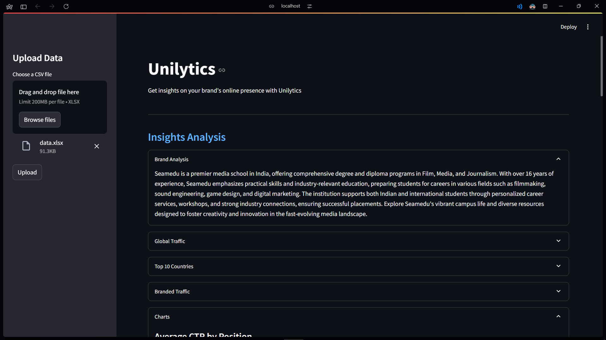
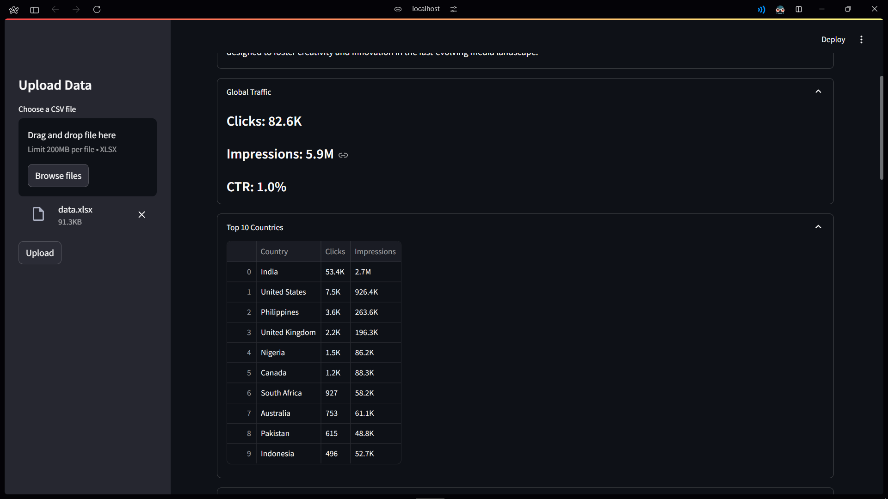
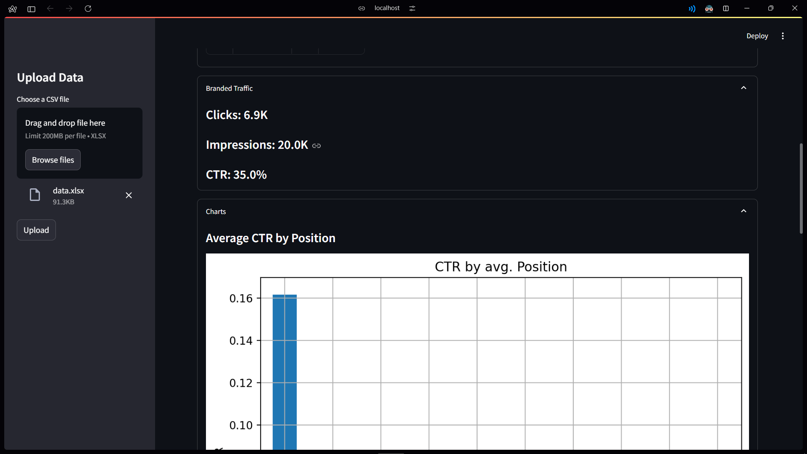
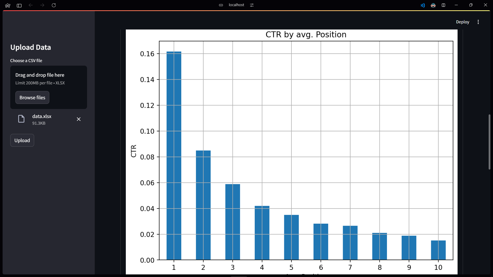
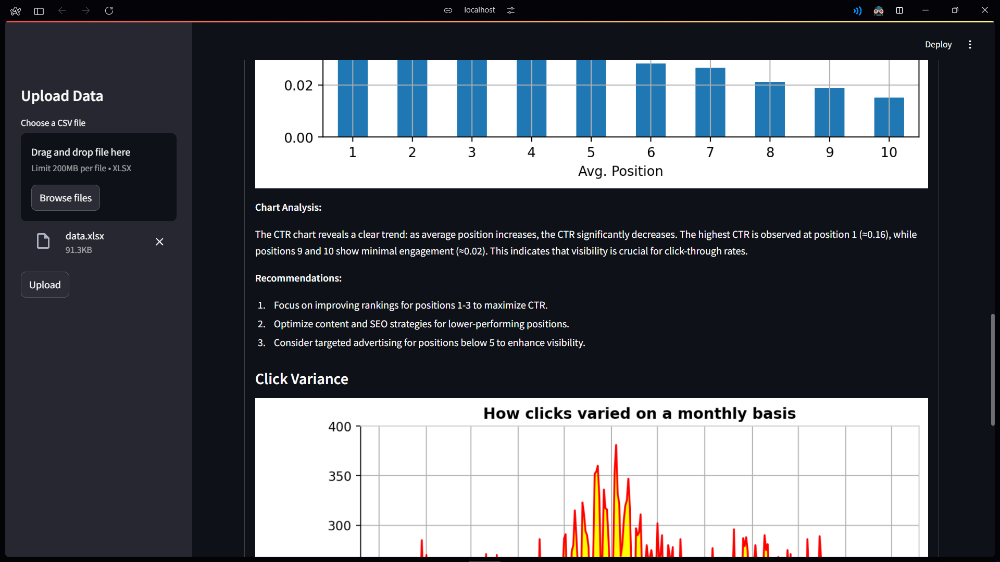
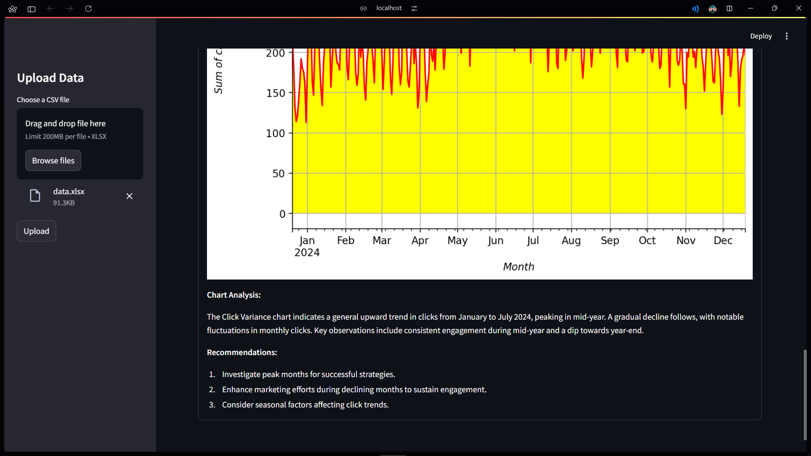

# Unilytics
Dashboard for generating insights from Google Search Console data.

## Installation
1. Clone the repository
```bash
git clone https://github.com/suryanshgupta9933/unilytics.git
cd unilytics
```
2. Install the dependencies
```bash
pip install -r requirements.txt
```
3. Rename the `.env.example` file to `.env` and add your OpenAI API key.
4. Run the app
```bash
streamlit run app.py
```

## Features
- Brand Analysis: LLM generates summary of brand using Landing Page data
- Global Traffic: Clicks, Impressions and CTR for the website globally
- Top 10 Countries: Table showing top 10 countries with highest traffic
- Branded Traffic: Clicks, Impressions and CTR for the brand
- Charts:
    - Average CTR by Position
    - Click Variance

## Screenshots






